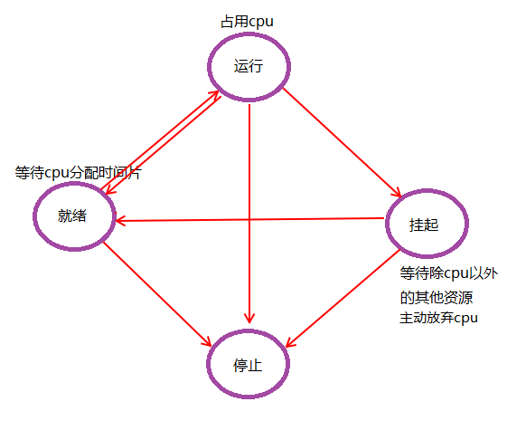

### 并发编程

	所谓并发编程是指在一台处理器上“同时”处理多个任务
    最早支持并发编程的语言是汇编语言

#### 基本概念
##### 并发和并行

1. 并行：借助多核CPU实现  真并行,并行基于硬件
2. 并发：    假并发，基于系统控制
    1. 宏观
    	1. 在一段时间内，有多个程序在同时运行
    	2. 用户体验上，程序在并行执行
    	3. 人的体验在毫秒级
    2. 微观
    	1. 多个计划任务，顺序执行，在飞快的切换，轮换使用CPU时间轮片

##### 多元程序和多元处理
1. 多元程序：串型程序运行在一个或多个可共享的cpu之上，多个程序并行
2. 多元处理：多个CPU共用一个存储器（即内存),并且在同一时刻可能会有数个串行程序分别运行在不同的CPU上

##### 并发程序特点
1. 不确定性
	1. 串行程序中所有活动的顺序都是固定的，而在并发程序中，只是部分有序。这种部分有序导致了并发程序每次的执行路径都不大相同，即使有相同的输入，也可能有不同的结果

2. 内部交互
	1. 共享数据
		1. 程序使用共享数据，需要先获取资源的访问权（涉及锁机制），使用后释放使用权。
		1. 同步机制：根据同步机制管理共享数据，只允许某个资源在同一时刻只允许被一个程序占用
		2. 异步机制：可同时使用的数据
	2. 传递数据
		1. 同步机制，可能造成发送方/接受方 阻塞
		2. 异步机制：一般会使用一种队列机制

##### 多进程编程
1. 进程和程序：
	1. 程序：编译成功得到的二进制文件，占用磁盘空间
		1. 程序是Unix操作系统的根本，所有的代码都在进程中执行。
	2. 进程：执行起来的程序，占用系统资源
		1. 一个抽象概念，与操作系统原理联系紧密
		2. 程序运行起来，产生一个进程（多个）
	3. 程序和进程分别描述了一个程序的静态形式和动态形式。
	4. 进程是操作系统分配资源的一个基本单位
	5. 
3. IPC（interprocess Communication)进程间通信
	1. 多进程程序协作
	2. <table cellspacing="0">
        <tr>
            <th>处理机制</th>
            <th>手段</th>
            <th>实现</th>
            <th>备注</th>
        </tr>
        <tr>
            <td rowspan="3">基于通讯的IPC方法</td>
            <td rowspan="2">数据传输</td>
            <td>管道(pipe)</td>
            <td rowspan="2">传送字节流</td>
        </tr>
        <tr>
            <td>消息队列(message queue)</td>
        </tr>
        <tr>
            <td>共享内存</td>
            <td>共享内存区(shared memory)</td>
            <td>传送结构化的消息对象，最快的一种IPC</td>
        </tr>
        <tr>
            <td>基于信号</td>
            <td>操作系统的信号(Signal)机制</td>
            <td></td>
            <td>唯一一种异步IPC方法</td>
        </tr>
        <tr>
            <td>基于同步</td>
            <td></td>
            <td></td>
            <td>最重要的就是信号灯(Semaphore)</td>
        </tr>
    </table>
3. 进程的衍生
	1. 一个进程可以使用系统函数fork创建若干个新进程，前者称为后者父进程，后者称为前者子进程
	2. 每个子进程都是父进程的一个副本：获得父进程的数据段、堆、栈的副本，并与父进程共享代码段。
	3. 每个进程都是进程隔离的
	4. COW(copy on write)
		1. linux系统fork进程的时候，采用cow机制，即共享代码段，为子进程数据段/堆/栈创建虚拟内存地址，但引用的物理地址仍是父进程对应地址，采用COW提高了进程的创建效率
		2. COW意味着，只有进程空间中各段内容发生改变的时候，才会将父进程中内容复制一份，分配独立物理地址给子进程。注意：copy之前，子进程各段拥有独立的虚拟内存地址，但物理地址是相同的
		3. cow全部替换后，代码段是继续共享父进程的物理地址的（两者代码完全一致）,只有执行exec之后，代码段也会被覆盖，执行不同的代码
		4. 使用cow技术的fork，并不初始化这个子进程，也就是说这个子进程的代码段/数据段/堆/栈完全是父进程的副本
	5. fork调用
		1. fork可以创建一个新进程
		2. 传统fork方式，直接将父进程的一切copy一份给子进程，造成较多的资源开销
		3. fork后子进程会有独立的PID，累计执行时间清零。
		4. 返回值：
			1. 执行fork调用之后，父进程接收一个返回值---子进程的PID
			2. 子进程接受一个信号（成功为0，不成功为-1）
		5. 执行后动作
			1. 父进程：
				1. 等待子进程终止
				2. 离开去执行其他事情
			2. 子进程一般会接着执行exec
		6. linux执行顺序
			1. fork之后，系统会将子进程排在队列的前面，先完成exec初始化操作，这是为了避免父进程执行代码，导致COW，而后子进程执行exec，再次复制，无意义的copy造成效率的下降。
	6. exec调用
		1. 准确的说exec是一个函数簇，由六个函数组成
		2. 调用exec后，进程的PID没变，代码段/数据段/堆栈段/上下文都进行了替换，之后就运行新的内容

2. 进程状态：
	1. 初始态，变量初始化，内存申请等
	2. 就绪态，等待CPU分配时间轮片
	3. 运行态，占用CPU
	4. 挂起/阻塞/睡眠态，等待除CPU意外的其他资源，主动放弃CPU使用权
		1. 挂起态：是一种主动状态，由系统或程序发起，不释放CPU资源，释放内存资源（将程序从内存中移到外部-->磁盘或其他存储)，待条件允许在调回内存中
		2. 阻塞：因等待获取资源，程序必须的等待，是一种被动的状态，释放CPU，不释放内存
		3. 睡眠：一种主动的状态，一般是为了等待io操作，被标记为不可执行，从队列中移除
	5. 终止态
	6. 
	6. 

3. linux进程状态转换
	1. 可运行状态（TASK_RUNNING简称R)
	2. 可中断的睡眠状态（TASK_INTERRUPTIBLE，简称S)
	3. 不可中断的睡眠状态（TASK_UNINTERRUNPTIBLE，简称D)
		1. 一般是IO操作引起，为了保护io设备操作完整，防止出现不可控状况
	4. 暂停状态或跟踪状态（TASK_STOPPED或TASK_TRACED,简称为T)
	5. 僵尸状态（TASK_DEAD-EXIT_ZOMBIE，简称Z）
	6. 退出状态（TASK_DEAD-EXIT_DEAD,简称X）
	7. 状态转换图：
		
	8. linux   ps命令还有中I状态，表示空闲状态（idle）
	9. [状态转换说明](https://blog.csdn.net/shenwansangz/article/details/51981459)

5. 进程的标识
	1. 进程标识不是一个简单的符号，而是一个非常复杂的数据结构
		1. 包括进程的优先级、状态、虚拟地址范围、各种权限等。
	2. 进程ID是进程在操作系统中的唯一标识。
		3. os.Getpid()
		4. os.GetPPid()
		5. 内核可以高效的把进程ID转换成对应进程的描述符

8. 进程的空间
	1. 用户的程序，在用户空间中执行，但不能与所在计算机的硬件进行交互。
	2. 内核运行在内核空间中，可以与硬件交互。
	3. 用户进程不能直接访问内核空间
	4. 这两个空间指的都是操作系统在内存上划分的一个范围，两者共同瓜分了内存区域
	5. 操作系统使用指针标识和定位内存区域中的内存单元，指针的数量由cpu的位数决定（32位系统位2^32, 64位操作系统位2^64。
	6. 内核空间和用户空间指的内存地址都是虚拟内存地址（mmv管理物理内存和虚拟内存之间的映射关系），用户空间的虚拟内存地址范围是0~TASK_SIZE之间的空间，TASK_SIZE由计算机体系结构决定。
	7. 虚拟内存的最大容量与实际可用的物理内存大小无关，MMU模块会管理两者之间的映射关系
	8. 用户进程分配到的虚拟内存空间都是整个用户空间大小，都认为自己获得了真个用户空间的使用权。不同用户进程的用户空间之间相互独立且不可见的，互相之间不能进行交叉操作
	9. 内核把进程的虚拟内存分为不同的页（page)，物理内存单元的划分由CPU负责，一个物理内存单元称为一个页框（frame）
	10. 允许不同用户进程的虚拟内存地址指向同一个物理内存页框，这是IPC方法共享内存区的基础。
	11. 有的虚拟内存页没有指向物理内存页框，可能有两种状况：
		1. 该虚拟内存还没有被使用
		2. 该内存中数据已经交换到了swap中
		
7. 系统调用
	1. 用户进程生存在用户空间，不能直接操作计算机硬件，需要借助内核空间中的内核程序。但用户进程无法直接访问内核空间，也无法指使内核程序执行操作，所以内核程序暴露出一系列的接口，用于用户进程使用内核功能。
	2. 系统调用有两层含义：一层指系统封装的调用内核操作的函数，另一层是用户进程调用这些系统调用接口的动作
	3. 系统调用是用户进程使用内核功能（包括操作计算机硬件）的唯一手段
	4. 系统函数和普通函数的区别
		1. 系统调用是向内核发出一个明确的请求，普通函数则只定义了如何获取一个给定服务
		2. 系统调用会导致内核空间中数据的存取和指令的执行，普通函数则只是在用户空间中动作
		3. 系统调用是内核的一部分，普通函数不是
	5. 用户态和内核态
		1. 内核根据CPU由CPU提供的、可以让进程驻留的特权级别建立的两个特权状态
		2. 用户态运行的是用户进程，不能与内核接触
		3. 用户进程发出系统调用时，CPU转换到内核态，执行完系统调用，转换会用户态
	6. 系统调用流程

	

3. 进程并发：
	1. unix/linux中，有可能会产生孤儿进程或僵尸进程
		1. 父进程无法预测子进程到底什么时候结束，进程工作终止时，父进程需要调用系统调用取得子进程的终止状态
			1. 孤儿进程：
				1. 父进程先于子进程结束，子进程成为孤儿进程
				2. 子进程的父进程成为init进程，称为init进程领养孤儿进程
			2. 僵尸进程
				1. 进程终止，父进程尚未回收，子进程残余PCB存放于内核中，变成僵尸进程
	2. 系统开销比较大，占用资源比较多，开启进程数量比较少
	3. 稳定性最好，某个进程被终止，不会影响其他进程

4. 进程内存地址空间：
	1. 进程创建后，向系统申请的单独内存空间
	2. 虚拟内存地址（32位系统会分配4G），实际占用没这么大，需要多少，分配多少

5. 进程的切换和调度
	1. 进程切换：进程获得CPU使用权/释放CPU使用权的过程中发生进程的切换，主要由内核完成，期间发生进程上下文切换
	2. 进程调度：内核决定进程切换的顺序，时机称为进程调度
	3. 进程切换和进程调度是程序并发执行的基础

##### 同步
1. 竞态条件：
	1. 几个进程同时对一个资源进行访问时，很可能会造成干扰，这种干扰称为竟态条件
	2. 造成竟态条件的根本原因是，进行某项操作时被中断了，当再次恢复上下文后，虽然状态看起来一致，但外部环境已经改变（变量值/数据库内容）。

2. 原子操作（atomic）
	1. 执行中不能中断的操作
	2. CPU（即使是多核CPU/多CPU计算机）硬件层面支持原子操作
	3. 如果一个原子操作一直未执行完，则会出问题，因为我们不能中断它，所以内核只提供二进制位和整数的原子操作
	4. sync/atomic
3. 临界态（critical section）
	1. 只能被串行化的访问或操作（针对某个资源或某段代码）
	2. 相较于生成原子操作，形成临界区以保证代码正常执行更通用---互斥（mutex)
	3. 实现互斥的方法必须保证排它原则，这种保证不能依赖于任何计算机硬件。
4. 原子操作和临界态
	1. 原子操作中不能发生中断
	2. 临界态不强制要求执行期间是否有中断，只要保证一个访问者操作结束之前，另一个访问者不会获得执行权
	协同步调，规划
线程同步：

	一个线程发出某一功能调用时，在没有得到结果之前，该调用不返回，同时其他线程为保证数据一致性，不能调用该功能
    “多个控制流，共同操作一个共享资源”时，都需要同步机制

#### 线程并发：

线程概念：
1. LWP：light weight process 轻量级的进程，本质仍是进程（linux)
	1. 线程共享进程分配到的资源，线程资源在进程资源内部
	2. 线程与线程之间资源隔离
2. 进程：独立地址空间，拥有PCB
3. 线程：有独立的PCB，但没有独立的地址空间（共享）
4. 生成线程之后，争夺CPU轮片时，以线程为单位，
	1. 线程作为最小的系统执行单位
	2. 进程作为最小的系统资源分配单位
	3. 时间片轮转调度算法

windows系统下，可以直接忽略进程的概念，因为线程是最小的执行单位，是被系统独立调度和分派的基本单位，而进程只是给线程提供执行环境
	

    

    
锁的应用
1. 互斥量（互斥锁）
	Linux中提供一把互斥锁mutex（互斥量）
    同一时刻，只能有一个线程持有该锁
    互斥锁实质上是操作系统提供的一把“建议锁”，建议程序中有多线程访问共享资源的时候使用该机制，没有强制限定
    	也就是说，A线程对资源加了锁，B资源不获取锁，直接访问，可以访问到数据，可能出现脏数据
2. 读写锁
	1. 读写锁是同一把锁，有读和写两种属性
	2. 写属性独占，读属性共享
	3. 写锁优先级高

协程并发：
	协程：coroutine,轻量级线程
  	一个线程中可以有任意多个协程，同一时刻只能有一个协程在运行，多个协程分享该线程分配到的计算机资源
    为了提高程序执行效率
    多数语言支持协程需要单独类库，一般只提供协程的创建等，具体实现需要定义
    io操作的等待时间是对cpu资源的浪费，协程可以实现这部分资源的有效利用
    
   